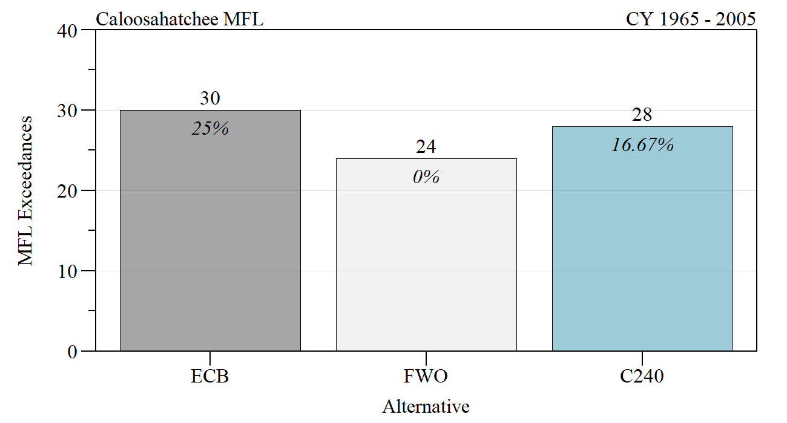

```{r setup, include=FALSE}
library(knitr)

options(htmltools.dir.version = FALSE)
knitr::opts_chunk$set(warning = FALSE, message = FALSE, echo=FALSE)

##
library(flextable)
library(magrittr)
library(plyr)
library(reshape2)

wd="C:/Julian_LaCie/_GitHub/CEPP_ModelEval"

plot.path=paste0(wd,"/Plots/")
export.path=paste0(wd,"/Export/")

plot.figs=list.files(plot.path,full.names=T)
slides.figs=paste0(wd,"/slides/Plots")
file.copy(plot.figs,slides.figs,overwrite=T,recursive=T)
```

layout: true

<div class="my-footer">
<span>  </span>
</div>

---
name: title
class: left, middle

### CEPP PACR Evaluation

.pull-left[


*Sanibel-Captiva Conservation Foundation*

*Conservancy of Southwest Florida*

**DRAFT** - `r paste(format(as.Date("2022-06-02"),"%B %d, %Y"))#  ,"<br>(Updated:", format(as.Date(Sys.Date()),"%B %d, %Y"),")")`

]
<!-- this ends up being the title slide since seal = FALSE-->

.pull-right[
```{r ,fig.align="center",out.width="40%"}
knitr::include_graphics('./Plots/SCCF Logo knockout_c.png')
```

```{r ,fig.align="center",out.width="40%"}
knitr::include_graphics('./Plots/ConSWFL.jpeg')
```

]


```{r xaringanExtra, include=FALSE, warnint=FALSE}
# devtools::install_github("gadenbuie/xaringanExtra")
# xaringanExtra::use_webcam()
xaringanExtra::use_tile_view()
# xaringanExtra::use_scribble()
```
.footnote[
Paul Julian PhD<br>[`r fontawesome::fa("fas fa-envelope")`](mailto: pjulian@sccf.org) .small[pjulian@sccf.org]

.small[Use cursor keys for navigation, press .red["O"] for a slide .red[O]verview]

```{r} 
bsplus::bs_button(
    label = "Download PDF Version",
    button_type = "primary",
    button_size = "small") %>%
    htmltools::a(
      href = "https://sccf-tech.github.io/CEPP_ModelEval/slides/SCCF_CEPP_Eval.pdf"
      )
```
]

---
name: alternatives

### General Description


```{r}

data.frame(Alternative=c("ECB","FWO","C240"),
           Description=c(
             "Modified Water Deliveries (MWD) complete; CERP projects in construction, not operational; WCA3/ENP Ops under ERTP; LORS08 ",
             "MWD, C111 South Dade, KRR, RS, TT next steps; CERP projects operational IRL-S, PSRP, C43, C111, CEPP; WCA3/ENP Ops under ERTP w/CEPP; LORS08 w/CEPP (LORS08++)",
             "FWO + EAA Reservoir and STA (240,000 ac-ft above-ground reservoir & 6,500-acre STA)"
           ))%>%
  flextable()%>%
  colformat_char(na_str="---")%>%
  width(width=c(1,5))%>%
  padding(padding=0.1,part="all")%>%
  font(fontname="Times New Roman",part="all")%>%
  fontsize(size=10,part="body")%>%
  fontsize(size=12,part="header")%>%
  bold(part="header")
```

* RSMBN modeling Period of Simulation - Jan 1, 1965 to Dec 31, 2005

---
name: RegQ

### Regulatory Discharge

```{r,out.width="90%",fig.align="center",fig.cap="Regulatory discharge from Lake Okeechobee" }

knitr::include_graphics("./Plots/AvgFloodControl.png")
```

---
name: RegQ

### Regulatory Discharge

```{r}
# data.frame(Region = c("EAA", "Caloosahatchee", "St. Lucie", "Lake Worth Lagoon"), 
#     ECB = c(59.9295089890822, 420.325606910356, 198.29611055752, 
#     93.2378830826227), FWO = c(298.216499721173, 257.658008765432, 
#     126.394573648115, 17.9086406435603), C240 = c(501.839181203249, 
#     172.331744079033, 103.745277120777, 8.64457665315613), PerDiff_FWO = c(68.2801527321458, 
#     -33.1160925659712, -17.9195165374691, -51.7295766596076), 
#     PerDiff_ECB = c(737.382434243994, -59.0004174749727, -47.681637915594, 
#     -90.7284717677516))
regq.dat.CY.mean=read.csv(paste0(export.path,"/LOK_regQ.csv"))
regq.dat.CY.mean=regq.dat.CY.mean[match(c("WCAs","Cal","StL","LWLagoon"),regq.dat.CY.mean$Region),]
  
regq.dat.CY.mean%>%
  flextable()%>%
  colformat_double(j=2:6,digits=0)%>%
  compose(j="Region",i=~Region=="WCAs",value=as_paragraph('EAA'))%>%
  compose(j="Region",i=~Region=="Cal",value=as_paragraph('Caloosahatchee'))%>%
  compose(j="Region",i=~Region=="StL",value=as_paragraph('St. Lucie'))%>%
  compose(j="Region",i=~Region=="LWLagoon",value=as_paragraph('Lake Worth Lagoon'))%>%
  set_header_labels("PerDiff_FWO"="FWO vs C240",
                    "PerDiff_ECB"="ECB vs C240")%>%
  add_header("ECB"="Avg Annual total discharge (kAc-Ft Yr\u207B\u00B9)",
             "FWO"="Avg Annual total discharge (kAc-Ft Yr\u207B\u00B9)",
             "C240"="Avg Annual total discharge (kAc-Ft Yr\u207B\u00B9)",
             "PerDiff_FWO"="Percent Difference",
             "PerDiff_ECB"="Percent Difference")%>%
  merge_h(part="header")%>%align(align="center",part="header")%>%
  width(width=c(1.5,0.75,0.75,0.75,1.2,1.2))%>%
  padding(padding=1.5,part="all")%>%
  vline(j=c(1,4))%>%
  align(j=2:6,part="all",align="center")%>%
  font(fontname="Times New Roman",part="all")%>%
  fontsize(size=12,part="all")%>%
  fontsize(size=13,part="header")%>%
  set_caption(caption="Mean annual flood control releases from Lake Okeechobe for the 41-year period of simulation with percent difference relative to FWO and ECB.")#%>%print("docx")


```


---
name: WCAs

### Everglades Discharge

```{r,out.width="75%",fig.align="center",fig.cap="Total discharges to WCAs from EAA during the 41-year peroid of simulation." }


```

```{r}
regq.dat.CY.mean2=read.csv(paste0(export.path,"EAA_totalQ_WCAs.csv"))
```

* % Difference FWO vs C240: `r paste0(round(subset(regq.dat.CY.mean2,type=="total")$PerDiff_FWO,1),"%")`

* % Difference ECB vs C240: `r paste0(round(subset(regq.dat.CY.mean2,type=="total")$PerDiff_ECB,1),"%")`


---
name: CRE1

### CRE - Salinity Envelope (2007 PM)

```{r,out.width="100%",fig.align="center",fig.cap="Caloosahatchee salinity envelope evaluation (2007 RECOVER PMs)"}


```

---
name: CRE2

### CRE - Salinity Envelope (2020 PM)

```{r,out.width="100%",fig.align="center",fig.cap="Caloosahatchee salinity envelope evaluation (2020 RECOVER PMs)"}


```

---
name: CRE MFL1

### Caloosahatchee MFL

```{r,out.width="80%",fig.align="center",fig.cap="Caloosahatchee MFL for Alternative C240."}


```

---
name: CRE MFL2

### Caloosahatchee MFL

```{r,out.width="100%",fig.align="center",fig.cap="Caloosahatchee MFL percent difference relative to FWO."}


```


---
name: CRE Q

### Caloosahatchee Discharge 

```{r,out.width="100%",fig.align="center",fig.cap="Discharges to Caloosahatchee below, within and above zone D of the Lake regulation schedule."}


```

---
name: SLE

### SLE - Salinity Envelope

* waiting on some additional modeling data

