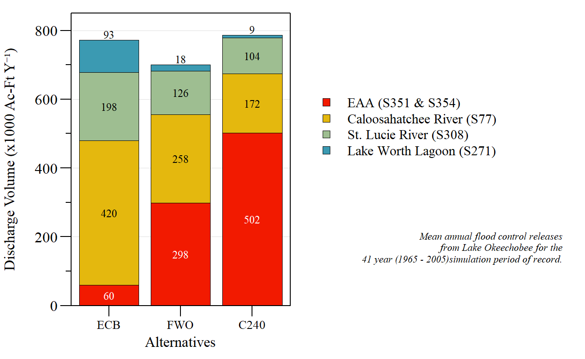

```{r setup, include=FALSE}
library(knitr)

options(htmltools.dir.version = FALSE)
knitr::opts_chunk$set(warning = FALSE, message = FALSE, echo=FALSE)

##
library(flextable)
library(magrittr)
library(plyr)
library(reshape2)

wd="C:/Julian_LaCie/_GitHub/LOWRP_ModelEval"

plot.path=paste0(wd,"/Plots/")
export.path=paste0(wd,"/Export/")

plot.figs=list.files(plot.path,full.names=T)
slides.figs=paste0(wd,"/slides/Plots")
file.copy(plot.figs,slides.figs,overwrite=T,recursive=T)
```

layout: true

<div class="my-footer">
<span>  </span>
</div>

---
name: title
class: left, middle

### Lake Okeechobee Watershed Restoration Project

.pull-left[


*Sanibel-Captiva Conservation Foundation*

*Conservancy of Southwest Florida*

**DRAFT** - `r paste(format(as.Date("2022-03-07"),"%B %d, %Y"))#  ,"<br>(Updated:", format(as.Date(Sys.Date()),"%B %d, %Y"),")")`

]
<!-- this ends up being the title slide since seal = FALSE-->

.pull-right[
```{r ,fig.align="center",out.width="40%"}
knitr::include_graphics('./Plots/SCCF Logo knockout_c.png')
```

```{r ,fig.align="center",out.width="40%"}
knitr::include_graphics('./Plots/ConSWFL.jpeg')
```

]


```{r xaringanExtra, include=FALSE, warnint=FALSE}
# devtools::install_github("gadenbuie/xaringanExtra")
# xaringanExtra::use_webcam()
xaringanExtra::use_tile_view()
# xaringanExtra::use_scribble()
```
.footnote[
Paul Julian PhD<br>[`r fontawesome::fa("fas fa-envelope")`](mailto: pjulian@sccf.org) .small[pjulian@sccf.org]

.small[Use cursor keys for navigation, press .red["O"] for a slide .red[O]verview]

```{r} 
bsplus::bs_button(
    label = "Download PDF Version",
    button_type = "primary",
    button_size = "small") %>%
    htmltools::a(
      href = "https://sccf-tech.github.io/LOWRP_ModelEval/slides/SCCF_LOWRP_Eval.pdf"
      )
```
]

---
name: alternatives

### General Description


```{r}

data.frame(Alternative=c("ECB","FWO","1BWR","ASR"),
           Description=c(
             "KRR partial complete; HHD under construction; C44 & C43 under construction; LORS08 schedule (cira 2012)",
             "KRR & HHD complete; C44, C43 and C23/24 complete; CEPP feautres operational; LORS08 schedule (cira 2025)",
             "Wetland Attenuation Feature - 43000 acres; 80 ASR wells; wetland restoration; LORS08 (cira 2025)",
             "WAF removed; 55 ASR wells; wetland restoration; LORS08 (cira 2025)"
           ))%>%
  flextable()%>%
  colformat_char(na_str="---")%>%
  width(width=c(1,5))%>%
  padding(padding=0.1,part="all")%>%
  font(fontname="Times New Roman",part="all")%>%
  fontsize(size=10,part="body")%>%
  fontsize(size=12,part="header")%>%
  bold(part="header")
```

* RSMBN modeling Period of Simulation - Jan 1, 1965 to Dec 31, 2005

* Performance Measures
  * Both 2007 and 2020 Lake Okeechobee Stage and Northern Estuaries Salinity Envelopes were used to evaluate LOWRP alternatives.
---
name: RegQ

### Regulatory Discharge

```{r,out.width="100%",fig.align="center",fig.cap="Regulatory discharge from Lake Okeechobee" }


```

---
name: LOKStage

### LOK Daily Stage Distribution

```{r,out.width="60%",fig.align="center"}


```


---
name: LOKStage

### LOK Stage Duration Curves

```{r,out.width="100%",fig.align="center",fig.cap="Stage duration curves for 1BWR and ASR alternatives relative to ECB and FWO baseline conditions." }

knitr::include_graphics("./Plots/LOK_stage_curve.png")
```

---
name: LOKStage

### LOK Stage Duration Curves

```{r,out.width="60%",fig.align="center"}

knitr::include_graphics("./Plots/LOK_stg_duration_chunk.png")
```

---
name: LOKStage

### LOK Stage Conditions

```{r,out.width="55%",fig.align="center"}


```

---
name: LOKStage

### LOK - High Stage Event and Duration

```{r,out.width="100%",fig.align="center"}

knitr::include_graphics("./Plots/LOK_highstg_events.png")
```

---
name: LOKStage

### 2007 RECOVER PM

```{r,out.width="100%",fig.align="center"}


```

---
name: LOKStage

### 2020 RECOVER PM

```{r,out.width="100%",fig.align="center",fig.cap="Normal and recovery stage envelope timeline for each alternative."}

knitr::include_graphics("./Plots/LOK_NewEnv.png")
```

---
name: LOKStage

### 2020 RECOVER PM

```{r,out.width="100%",fig.align="center"}

knitr::include_graphics("./Plots/LOK_NewEnvScore_AllYrs.png")
```

---
name: LOKStage

### 2020 RECOVER PM

```{r,out.width="100%",fig.align="center"}

knitr::include_graphics("./Plots/LOK_NewEnvScore_MaySep.png")
```

---
name: LOKStage

### 2020 RECOVER PM

```{r,out.width="100%",fig.align="center"}

knitr::include_graphics("./Plots/LOK_NewEnvScore_RecYrs.png")
```

---
name: LakeQEstuary

### Regulatory Discharge

```{r,out.width="100%",fig.align="center",fig.cap="Stressful and damaging Lake discharges to CRE and SLE." }

knitr::include_graphics("./Plots/Lakedischarge_Annualmean.png")
```

---
name: EstuaryQ

### Daily Discharge

```{r,out.width="75%",fig.align="center",fig.cap="Daily discharge distribution during POS for each alternative and Estuary."}

knitr::include_graphics("./Plots/Estuary_DaQDesnity.png")
```

---
name: CRE MFL

### Caloosahatchee MFL

```{r,out.width="60%",fig.align="center",fig.cap="Caloosahatchee MFL Evaluation for each alternative."}

knitr::include_graphics("./Plots/CRE_MFL_Alt_all.png")
```

---
name: CRE MFL

### Caloosahatchee MFL

```{r,out.width="100%",fig.align="center",fig.cap="Caloosahatchee MFL percent difference relative to FWO."}

knitr::include_graphics("./Plots/CREMFL_Alts.png")
```

---
name: CRE MFL

### CRE - Salinity Envelope

```{r,out.width="100%",fig.align="center",fig.cap="Caloosahatchee salinity envelope evaluation (2007 & 2020 PMs)"}

knitr::include_graphics("./Plots/RECOVER_CRE_SalEnv_all_2.png")
```

---
name: CRE MFL

### CRE - Salinity Envelope

```{r,out.width="100%",fig.align="center",fig.cap="Caloosahatchee salinity envelope evaluation relative to FWO."}

knitr::include_graphics("./Plots/RECOVER_CRE_SalEnv_FWO.png")
```


---
name: SLE Sal

### SLE - Salinity Envelope

```{r,out.width="100%",fig.align="center",fig.cap="St Lucie salinity envelope evaluation (2007 & 2020 PMs)"}

knitr::include_graphics("./Plots/RECOVER_SLE_SalEnv_all_2.png")
```

---
name: SLE Sal

### SLE - Salinity Envelope

```{r,out.width="100%",fig.align="center",fig.cap="St Lucie salinity envelope evaluation relative to FWO."}

knitr::include_graphics("./Plots/RECOVER_SLE_SalEnv_FWO.png")
```